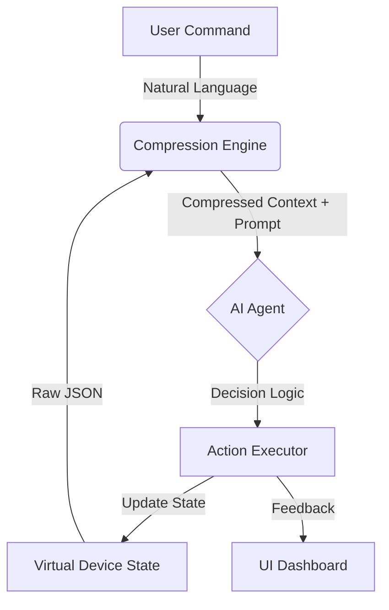

# Smart Home Orchestrator

**A Token-Efficient, Multi-Agent System for Intelligent Home Automation**

## Overview

The **Smart Home Orchestrator** is a GenAI-powered dashboard that bridges the gap between natural language and home automation. Built for the **GenAI4GenZ Scaledown Challenge**, it addresses a critical bottleneck in modern AI robotics: **Context Window Efficiency.**

Instead of feeding an LLM raw, bloated JSON data from dozens of IoT sensors, this system uses a **State Compression Algorithm** to convert home status into a token-efficient format. This allows for faster inference, lower costs, and complex multi-step reasoning (e.g., "Prepare the living room for a movie night") with minimal latency.

## Key Features

* **Intelligent "Router" Agent:** Understands intent (e.g., security, comfort, entertainment) and routes commands to the correct simulated devices.
* **State Compression Engine:** Reduces complex device JSON objects by up to **70%** before sending them to the LLM, optimizing for the "Scaledown" criteria.
* **Real-Time "Digital Twin" Dashboard:** A responsive UI (built with Next.js & Tailwind) that visualizes device states instantly as the AI manipulates them.
* **Conflict & Safety Reasoning:** The agent detects conflicting commands (e.g., "Open the window" while the AC is ON) and suggests efficient alternatives.
* **"Thought Process" Logs:** A visible debug panel showing the AI's reasoning steps, offering transparency into the decision-making process.

## Tech Stack

* **Frontend:** Next.js 14 (App Router), Tailwind CSS, Lucide React (Icons)
* **AI/Logic:** Vercel AI SDK / LangChain.js
* **Model Provider:** OpenAI GPT-4o / Gemini 1.5 Pro (Configurable)
* **State Management:** React Context API (Simulating IoT Local State)
* **Deployment:** Vercel

## Architecture



## Getting Started

Follow these instructions to set up the project locally.

### Prerequisites

* Node.js 18+ installed
* An API Key from OpenAI or Google Gemini

### Installation

1. **Clone the repository**
```bash
git clone https://github.com/yourusername/smart-home-orchestrator.git
cd smart-home-orchestrator

```


2. **Install dependencies**
```bash
npm install

```


3. **Configure Environment Variables**
Create a `.env.local` file in the root directory:
```env
OPENAI_API_KEY=your_api_key_here
# or GOOGLE_API_KEY=your_key

```


4. **Run the Development Server**
```bash
npm run dev

```


5. Open [http://localhost:3000](https://www.google.com/search?q=http://localhost:3000) to view the dashboard.

## Usage & Examples

Once the dashboard is running, you can interact with the **Command Bar** using natural language.

**Scenario 1: Complex Scene Setting**

> **User:** "I'm going to sleep now."
> **AI Action:**
> * *Checks State:* Living Room Lights (ON), Front Door (UNLOCKED).
> * *Execution:* Turns OFF lights, LOCKS the door, SETS thermostat to 20°C.
> * *Response:* "Goodnight. I've secured the house and lowered the temperature."
> 
> 

**Scenario 2: Conflict Resolution**

> **User:** "Turn the AC to 18 degrees and open the balcony door."
> **AI Action:**
> * *Reasoning:* Cooling with a door open is inefficient.
> * *Response:* "I can do that, but keeping the balcony door open will waste energy while the AC is running. Would you like me to just turn on the fan instead?"
> 
> 

## The "Scaledown" Factor (How it works)

To meet the workshop's efficiency criteria, raw device data is not sent to the LLM.

**Raw Input (Expensive):**

```json
// 150+ Tokens
[
  {"id": "light_01", "room": "kitchen", "state": "on", "brightness": 100},
  {"id": "light_02", "room": "living", "state": "off", "brightness": 0},
  {"id": "lock_01", "room": "front_door", "state": "unlocked"}
  ...
]

```

**Compressed Context (Efficient):**

```text
// ~20 Tokens
KITCHEN:L=ON(100); LIVING:L=OFF; FRONT:LOCK=OPEN

```

*This allows the model to process updates faster and with significantly lower API costs.*

## Future Roadmap

* **Phase 1 (Current):** Web-based simulation with virtual devices.
* **Phase 2:** Integration with **Home Assistant API** to control real-world smart plugs.
* **Phase 3:** Voice command integration using Web Speech API for hands-free control.
* **Phase 4:** Custom ESP32 firmware integration for low-cost DIY smart switches.

## Contributing

Contributions are welcome! Please fork the repository and submit a pull request for any new features or bug fixes.

## License

This project is licensed under the MIT License - see the [LICENSE](https://www.google.com/search?q=LICENSE) file for details.
---
